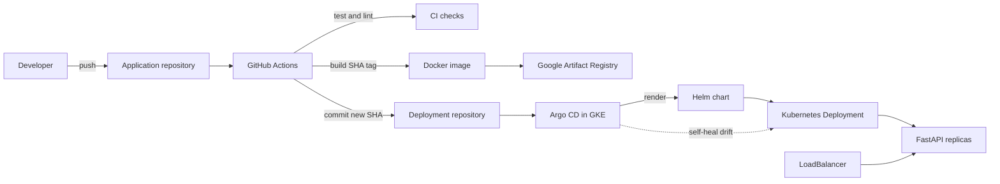

# End-to-End MLOps on GCP with GitOps

A production-style reference implementation for serving a scikit-learn K-nearest-neighbors model with FastAPI and
promoting every application change through an immutable, Git-driven deployment pipeline.

> This teaching repository packages the contents of the two required Git repositories in sibling
> directories so the complete system can be reviewed in one place. For an actual deployment,
> publish `application/` as the application repository and `deployment/` as a separate deployment
> repository. `infrastructure/` and the bootstrap scripts can live in a dedicated platform
> repository or alongside the deployment repository.

## Architecture



The CI workflow has no Kubernetes credentials and never calls `kubectl`. Its final responsibility
is changing the image tag in Git. Argo CD is the only deployment actor, making the deployment
repository the source of truth.

## Repository layout

```text
.
├── application/                 # Repository 1: service, model, image, tests, CI
│   ├── app/                     # FastAPI startup/model-loading and endpoints
│   ├── models/current/          # Production model and registry metadata
│   ├── scripts/train_model.py   # MLflow experiment training and evaluation
│   ├── scripts/register_model.py # Registry, promotion, and export commands
│   ├── tests/                   # API tests
│   ├── .github/workflows/       # CI image build and GitOps promotion
│   └── Dockerfile
├── deployment/                  # Repository 2: desired deployment state
│   ├── charts/ml-api/           # Reusable Helm chart
│   ├── environments/            # Dev and production values
│   └── argocd/application.yaml  # Auto-sync, prune, and self-heal policy
├── infrastructure/terraform/    # GKE, Artifact Registry, network, and GitHub OIDC
└── scripts/                     # One-time Argo CD bootstrap and load test
```

## API

| Method | Path | Purpose |
|---|---|---|
| `GET` | `/healthz` | Liveness and model-loaded status |
| `GET` | `/readyz` | Readiness; returns 503 until the model is loaded |
| `GET` | `/version` | Git/image version plus model artifact version |
| `POST` | `/predict` | Iris class and class probabilities |
| `GET` | `/metrics` | Prometheus-format request metrics |
| `GET` | `/docs` | OpenAPI/Swagger interface |

The approved model is exported from the MLflow registry into the Git-ignored `models/current/`
directory before the image build, copied into the container, and loaded once in FastAPI's application
lifespan before readiness succeeds. The running service is self-contained and never communicates
with MLflow, and no binary model artifact is committed to Git.

## Quick start locally

```bash
cd application
python -m venv .venv
. .venv/bin/activate
pip install -r requirements-dev.txt
python scripts/train_model.py
# Register, review, and manually promote the printed run ID; see application/README.md.
python scripts/register_model.py export-production
pytest -q
ruff check .
docker build -t ml-api:local .
docker run --rm -p 8080:8080 -e APP_VERSION=local ml-api:local
```

In a second terminal:

```bash
curl http://localhost:8080/healthz
curl http://localhost:8080/version
curl -X POST http://localhost:8080/predict \
  -H 'Content-Type: application/json' \
  -d '{"sepal_length":5.1,"sepal_width":3.5,"petal_length":1.4,"petal_width":0.2}'
```

## Cloud deployment

### 1. Create the two repositories

1. Create an application repository and copy the contents of `application/` to its root.
2. Create a deployment repository and copy the contents of `deployment/` to its root.
3. Protect both `main` branches. Permit the CI bot to update only the deployment repository.
4. Replace placeholder repository/image values in the deployment repository.

### 2. Provision Google Cloud

Create a Google Cloud project with billing enabled, then run:

```bash
cd infrastructure/terraform
cp terraform.tfvars.example terraform.tfvars
# Set project_id and github_repository in terraform.tfvars.
gcloud auth application-default login
terraform init
terraform plan
terraform apply
```

Terraform creates a VPC-native regional GKE cluster, a fixed two-node worker pool, Artifact
Registry, and narrowly scoped identities. GitHub authenticates through OIDC Workload Identity
Federation rather than a stored service-account key.

### 3. Configure application CI

In the application repository, define:

- Variables: `GCP_PROJECT_ID`, `GAR_LOCATION`, `GAR_REPOSITORY`, `DEPLOYMENT_REPOSITORY`,
  `MLFLOW_TRACKING_URI`, and `MLFLOW_MODEL_NAME`.
- Secrets: `GCP_WORKLOAD_IDENTITY_PROVIDER`, `GCP_SERVICE_ACCOUNT`,
  `DEPLOYMENT_REPOSITORY_TOKEN`, and any credentials required by the MLflow server.

Exact descriptions and examples are in `application/README.md`. Set the deployment repository's
`image.repository` to the Artifact Registry output before the first sync.

### 4. Bootstrap Argo CD once

From this repository (or a platform checkout), run:

```bash
export PROJECT_ID=my-ml-platform
export REGION=us-central1
export CLUSTER_NAME=ml-platform
export DEPLOYMENT_REPO_URL=https://github.com/my-org/ml-platform-deploy.git
./scripts/bootstrap-argocd.sh
```

This is the only cluster bootstrap step. Afterward, application deployments require no manual
`kubectl` or Helm commands. For private Git repositories, add Argo CD repository credentials before
creating the Application.

### 5. Verify production

```bash
kubectl -n argocd get applications ml-api-production
kubectl -n ml-api rollout status deployment/ml-api-production
kubectl -n ml-api get service ml-api-production
curl http://EXTERNAL_IP/version
```

The exact resource fullname depends on the Argo CD release name and chart helper; use
`kubectl -n ml-api get all` if you customize it.

## Model lifecycle

1. Train a model and log its parameters, metrics, evaluation artifacts, and model to MLflow.
2. Register the completed run as a new model version in a non-production state.
3. Review competing versions and their experiment metrics in MLflow.
4. Manually mark exactly one reviewed version as `Production`.
5. Push an application commit; CI downloads and packages only that Production model.
6. CI pushes the immutable container and updates the deployment repository's Helm image tag.
7. Argo CD detects the Git change and deploys it through Helm to Kubernetes.

MLflow decides **which** model is approved. GitHub Actions packages it. Argo CD is still the only
deployment actor, and Git remains the source of truth for deployment state.

## Demonstration runbook

1. Train Model A, register it as Version 1, review it, and manually promote Version 1.
2. Push an application commit and watch CI build an image containing Model Version 1.
3. Confirm CI commits the Git SHA to `environments/prod-values.yaml` in the deployment repository.
4. Watch Argo CD sync and Kubernetes roll out without downtime:

   ```bash
   argocd app get ml-api-production --watch
   kubectl -n ml-api rollout status deployment/ml-api-production
   ```

5. Call `/version` and verify `application_version`, `model_name`, `model_version`, and
   `mlflow_run_id` identify the deployed application and Model Version 1.
6. Train Model B, register it as Version 2, review it, and manually promote Version 2.
7. Push another application commit. Verify CI packages Version 2 and `/version` reports Version 2
   after Argo CD completes the rollout. No Kubernetes changes or direct MLflow-to-cluster access are
   required.
8. Demonstrate drift correction by changing replicas directly. Argo CD restores Git's value:

   ```bash
   kubectl -n ml-api scale deployment/ml-api-production --replicas=1
   kubectl -n ml-api get deployment/ml-api-production --watch
   ```

## Production-minded details

- **Immutable releases:** every container and Helm promotion uses the full Git SHA.
- **Safe rollout:** two or more replicas, readiness/liveness probes, rolling updates, and a Pod
  Disruption Budget.
- **Security:** non-root image and pod, dropped Linux capabilities, read-only root filesystem,
  disabled service-account token mounting, dedicated node identity, and keyless GitHub OIDC.
- **Operations:** Prometheus endpoint, resource requests/limits, HPA configuration, dev/prod values,
  structured logs, and Artifact Registry cleanup policies.
- **GitOps control:** automated Argo CD sync, pruning, retries, namespace creation, and self-healing.

## Cost and teardown

GKE worker nodes and a public LoadBalancer incur charges. Destroy the lab when finished:

```bash
terraform -chdir=infrastructure/terraform destroy
```

The Artifact Registry cleanup policy retains the 20 most recent versions and removes old untagged
artifacts, but inspect and delete any remaining images if the project itself is retained.
